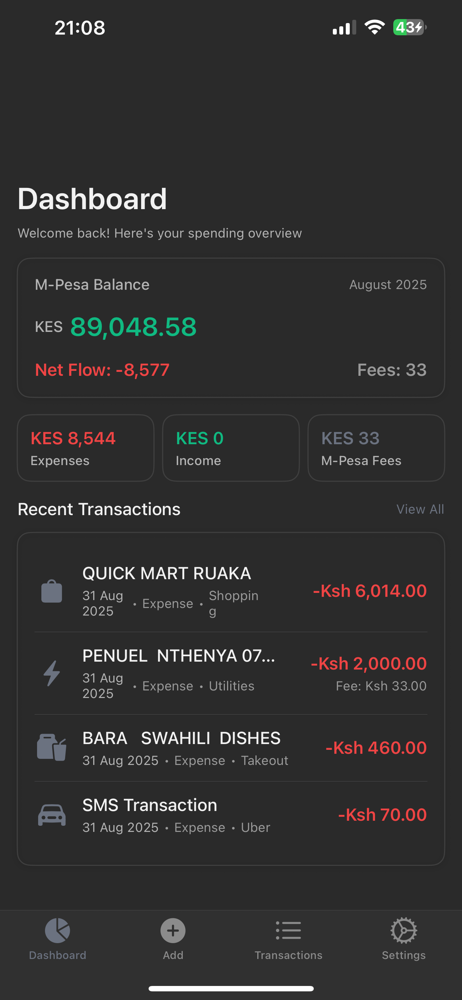
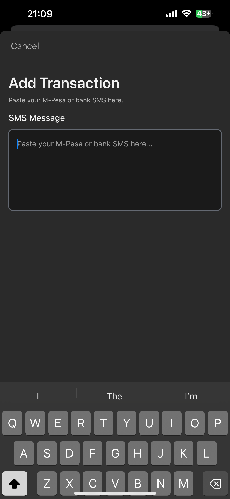
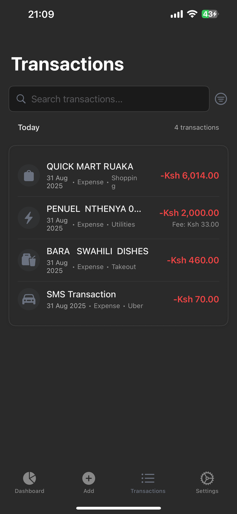
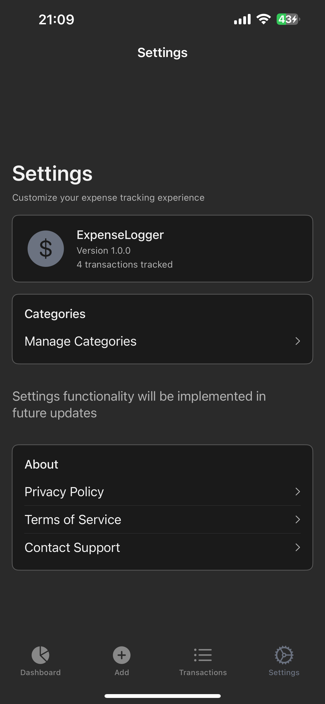
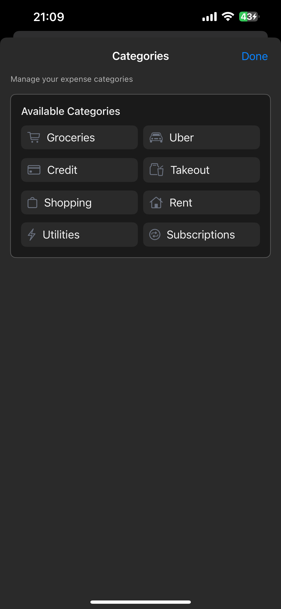

# 💰 ExpenseLogger

A modern iOS expense tracking application built with SwiftUI and SwiftData, designed specifically for Kenyan mobile money users. ExpenseLogger automatically parses M-Pesa SMS messages to track your financial transactions with a clean, professional interface.


## 📱 Screenshots

<div align="center">
  
  
  
  
  
</div>

### Key Screens
- **Dashboard**: M-Pesa balance overview with spending analytics and recent transactions
- **Add Transaction**: SMS input with real-time parsing and transaction preview
- **Transactions**: Searchable history with filtering and date grouping
- **Categories**: Expense category management with icons and customization
- **Settings**: App preferences and account management

## ✨ Features

### 📱 Core Functionality
- **Automatic SMS Parsing**: Intelligently extracts transaction data from M-Pesa, Loop, I&M Bank, and PesaLink SMS messages
- **Real-time Balance Tracking**: Maintains accurate M-Pesa balance history with transaction reconciliation
- **Smart Categorization**: Auto-categorizes transactions (Groceries, Uber, Takeout, Utilities, etc.)
- **Comprehensive Dashboard**: Overview of spending patterns, income vs expenses, and monthly summaries

### 🎨 Modern UI/UX
- **Claude-inspired Design**: Clean, minimalist interface with excellent dark mode support
- **Monochromatic Icon System**: Unified visual language throughout the app
- **Professional Typography**: Carefully crafted text hierarchy for optimal readability
- **Responsive Cards**: Beautiful card-based layout with subtle shadows and borders

### 📊 Financial Insights
- **Monthly Analytics**: Track expenses, income, and M-Pesa fees
- **Transaction History**: Searchable and filterable transaction list with date grouping
- **Balance Reconciliation**: Automatic balance validation and missing transaction detection
- **Category Management**: Customizable expense categories with icons and colors

### 🔧 Technical Features
- **SwiftData Integration**: Modern Core Data replacement for robust data persistence
- **SMS Transaction Converter**: Converts parsed SMS data to structured transaction records
- **Balance Calculator**: Advanced algorithms for financial calculations and trends
- **Comprehensive Testing**: Unit tests for SMS parsing with 95%+ accuracy

## 🚀 Getting Started

### Prerequisites
- Xcode 15.0 or later
- iOS 15.0 or later
- Swift 5.9 or later

### Installation

1. **Clone the repository**
   ```bash
   git clone https://github.com/mktowett/expense_tracker.git
   cd expense_tracker
   ```

2. **Open in Xcode**
   ```bash
   open ExpenseLogger.xcodeproj
   ```

3. **Build and Run**
   - Select your target device or simulator
   - Press `Cmd + R` to build and run

### First Launch Setup

1. **Default Categories**: The app automatically creates default categories on first launch
2. **Mock Data**: Sample transactions are available for testing the interface
3. **SMS Input**: Use the "Add Transaction" screen to manually input SMS messages for parsing

## 🏗️ Architecture

### Project Structure
```
ExpenseLogger/
├── Models/                 # Data models and Core Data entities
│   ├── Transaction.swift   # Main transaction model
│   ├── Category.swift      # Expense categories
│   ├── SMSTransaction.swift # SMS parsing models
│   └── MockData.swift      # Sample data for testing
├── Views/                  # SwiftUI views and screens
│   ├── DashboardView.swift # Main dashboard with balance card
│   ├── AddTransactionView.swift # SMS input and parsing
│   ├── TransactionsView.swift # Transaction history list
│   ├── SettingsView.swift  # App settings and preferences
│   └── MainTabView.swift   # Tab navigation
├── Services/               # Business logic and utilities
│   ├── SimpleSMSParser.swift # SMS message parsing engine
│   ├── BalanceCalculator.swift # Financial calculations
│   ├── BalanceReconciler.swift # Transaction reconciliation
│   └── SMSTransactionConverter.swift # Data conversion
├── Components/             # Reusable UI components
│   ├── CTButton.swift      # Custom button styles
│   ├── CTCard.swift        # Card container component
│   ├── CTTextField.swift   # Styled text input
│   └── CTTextView.swift    # Multi-line text input
└── DesignSystem/          # Design tokens and styling
    ├── Colors.swift        # Color palette with dark mode
    ├── Typography.swift    # Font system and text styles
    ├── Spacing.swift       # Layout spacing constants
    └── ViewExtensions.swift # SwiftUI view modifiers
```

### Key Technologies
- **SwiftUI**: Declarative UI framework
- **SwiftData**: Modern data persistence
- **Combine**: Reactive programming for data flow
- **Foundation**: Core utilities and data processing
- **XCTest**: Unit testing framework

## 📱 SMS Parsing Support

ExpenseLogger supports automatic parsing of SMS messages from major Kenyan financial service providers:

### Supported Providers
- **M-Pesa**: Send money, pay bills, receive money, balance inquiries
- **Loop Bank**: Card transactions and online payments
- **I&M Bank**: Bank transfers and account transactions
- **PesaLink**: Inter-bank transfers and payments

### Sample SMS Formats
```
M-Pesa: "Confirmed. Ksh1,200.00 paid to NAIVAS SUPERMARKET..."
Loop: "MARVIN, Online transaction of USD.23.20 has been approved..."
I&M: "Bank to M-PESA transfer of KES 4,750.00 to 254704701916..."
PesaLink: "KES 175,000 received from NATHAN CLAIRE..."
```

## 🎨 Design System

### Color Palette
- **Light Mode**: Clean whites and subtle grays
- **Dark Mode**: Claude-inspired dark charcoal (#1A1A1A) with elevated surfaces
- **Accent Colors**: Minimal use of color for better focus
- **Status Colors**: Green for income, red for expenses

### Typography
- **SF Pro**: System font with custom weight and size scales
- **Hierarchy**: 5 distinct text styles for clear information architecture
- **Accessibility**: Optimized for readability and VoiceOver support

### Components
- **CTButton**: 3 styles (primary, secondary, destructive)
- **CTCard**: Consistent card styling with shadows and borders
- **CTTextField/CTTextView**: Styled input components with focus states

## 🧪 Testing

### Running Tests
```bash
# Run all tests
xcodebuild test -scheme ExpenseLogger -destination 'platform=iOS Simulator,name=iPhone 15'

# Run specific test suite
xcodebuild test -scheme ExpenseLogger -only-testing:ExpenseLoggerTests/SMSParserTests
```

### Test Coverage
- **SMS Parsing**: Comprehensive tests for all supported message formats
- **Balance Calculations**: Financial logic validation
- **Data Models**: SwiftData relationship and validation tests
- **UI Components**: SwiftUI view testing

## 🤝 Contributing

We welcome contributions! Please follow these guidelines:

### Development Setup
1. Fork the repository
2. Create a feature branch (`git checkout -b feature/amazing-feature`)
3. Follow the existing code style and architecture
4. Add tests for new functionality
5. Ensure all tests pass
6. Submit a pull request

### Code Style
- Follow Swift API Design Guidelines
- Use SwiftUI best practices
- Maintain consistent naming conventions
- Add documentation for public APIs
- Keep functions focused and testable

### Pull Request Process
1. Update documentation for any new features
2. Add or update tests as needed
3. Ensure the app builds and runs without warnings
4. Update the README if needed
5. Request review from maintainers

## 📄 License

This project is licensed under the MIT License - see the [LICENSE](LICENSE) file for details.

## 🙏 Acknowledgments

- **Claude AI**: Inspiration for the clean, professional design aesthetic
- **Kenyan FinTech**: SMS message formats based on real-world usage
- **SwiftUI Community**: Best practices and design patterns
- **Open Source**: Built with love for the developer community

## 📞 Support

- **Issues**: [GitHub Issues](https://github.com/mktowett/expense_tracker/issues)
- **Discussions**: [GitHub Discussions](https://github.com/mktowett/expense_tracker/discussions)
- **Email**: [Your Email] (for security issues)

## 🗺️ Roadmap

- [ ] **Export Features**: CSV/PDF export functionality
- [ ] **Budget Tracking**: Monthly budget limits and alerts
- [ ] **Insights Dashboard**: Advanced analytics and spending patterns
- [ ] **Multi-Currency**: Support for additional currencies
- [ ] **Cloud Sync**: iCloud synchronization across devices
- [ ] **Widgets**: iOS home screen widgets for quick balance view
- [ ] **Watch App**: Apple Watch companion app

---

**Made with ❤️ in Kenya for the global community**
